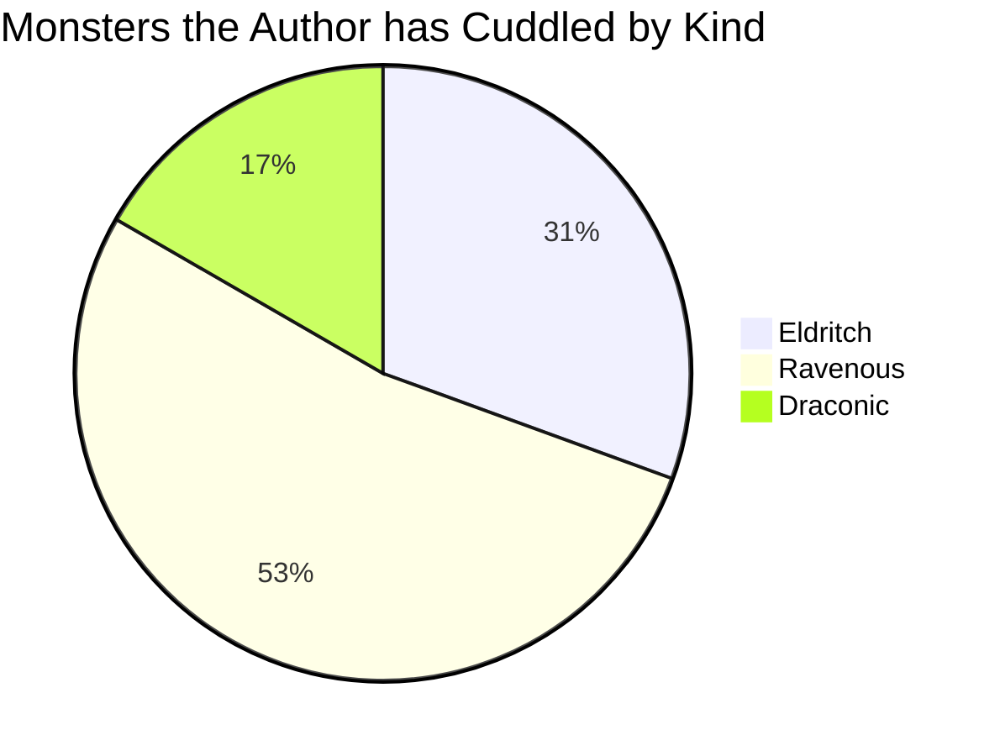

The `details` codeblock markup makes it possible for you to add an accessible and semantically accurate form of
collapsible content to a page.

When used, it inserts an [sref:`<sl-details>`] element from [sref:shoelace] to the page with a summary that's visible
even when the block is collapsed and the rendered markdown in a collapsible block. Readers can toggle the visibility of
the block, showing and collapsing the content.

## Syntax



## Examples

``````memo-example-renderer { title="Minimal Example" }
This text is rendered in an `sl-details` element with a `div` element containing
the summary text. The body text is formatted as Markdown.

Because the summary is specified, it's used as the display text. Note that you
can link [directly to this element](#minimal-details). The ID is automatically
generated from the summary.

<!--- Example Start -->
```details { summary="Minimal Details" }
This is some _Markdown_.

You can use any valid Markdown, including:

- unordered
- lists

1. ordered
1. lists

> blockquotes
```
``````

``````memo-example-renderer { title="Attributes Example" }
This example adds the `info` class to the details element and sets a specific
summary.

Normally, you could use the link fragment `#short-example` to link to this
block; however, because this example sets the ID to `dex-2`, you use
[that fragment](#dex-2) instead.

<!--- Example Start -->
```details { .info #dex-2 summary="Short Example" }
Another _Markdown_ example.
```
``````

`````````memo-example-renderer { title="YAML Options Example" }
This example ensures the block is loaded in its collapsed state instead of open
and sets the `heading_level` option to `4`. That ensures Platen writes the
summary inside an `<h4>` element, meaning the details block can show up in the
table of contents.

The example also sets the [`open` option](#option-open) to `false`, so the
details element is loaded in the collapsed state.

The example sets both the [`icon_collapse`](#option-icon_collapse) and
[`icon_expand`](#option-icon_expand) options. When these are both set, the
details are rendered with the specified icons to show that the block can be
collapsed or expanded.

The `icon_collapse` option shows the shorthand definition for an icon in
Platen. The `icon_expand` option shows the extended definition for an icon.
For more information, see the documentation for these options.

Note that this example also uses more backticks (`` ` ``) for the codeblock.
That lets you include nested codeblocks inside the details. Here it's used to
add a [mermaid diagram](mermaid.md).

<!--- Example Start -->
``````details
---
summary:       Heading Summary with Nested Codeblock
heading_level: 4
open:          false
icon_collapse: minus-square@lucide
icon_expand:
  name: plus-square
  library: lucide
---

Check out this neat diagram:


``````
`````````

``````memo-example-renderer { title="Legacy Example" }
This example uses the legacy template for rendering the details.

With `legacy` set to true in the attributes or YAML options, Platen renders the
Markdown in the older native `details` element instead of in an `sl-details`
element.

This option is included to allow folks to intentionally transition from the
legacy implementation to shoelace, which will become the default in the future.
Eventually, the legacy implementation will be removed.

For more information, see [Legacy Template](#legacy-template).

<!--- Example Start -->
```details { summary="Legacy Details" legacy=true }
Another _Markdown_ example.
```
``````

## Attributes

### `class` { #attribute-class }

Specify a string for the [sref:`class`][04] attribute of the details element. By default, it has no class and the div
element containing the content has the `markdown-inner` class.



### `id` { #attribute-id }

Specify an ID to use for the summary. If this value isn't specified, the summary's ID is set to the lowercased and
urlized form of the summary's input text. For example, the summary value `Really Important Info` would become the ID
`really-important-info`.

This value is ignored if `linkable` is set to `false`.



### `summary` { #attribute-summary }

Specify the text you want to use as the summary for the details. The default is `Details`. The rendered Markdown for
this value is displayed in the header, visible even when the details are collapsed.



## YAML Options

### `class` { #option-class }

Specify a string for the [sref:`class`][04] attribute of the details element. By default, it has no class and the `div`
element containing the content has the `markdown-inner` class.



### `custom` { #option-custom }

Specify whether this details block should use a custom template instead of the default or legacy template. Set this
option to `true` to use the custom template stubbed in `platen/markup/details/templates/custom`. If this value is `false`,
Platen uses the default or (if [`legacy`](#option-legacy) is `true`) [legacy](#legacy-template) template.

If this value is a string, Platen uses the value as the name of the partial template in
`platen/markup/details/templates` for rendering the details block.

For more information, see [Custom Templates](#custom-templates)



### `disabled` { #option-disabled }

Specify whether the toggle for the details should be disabled. Set this value to `true` to disable it. The default value
is `false`, ensuring the element can be collapsed and expanded.

This option isn't valid with the [legacy details](#legacy-template).



### `heading_level` { #option-heading_level }

Specify a number for the level of [sref:heading element (`<h1>-<h6>`)][05] that the summary text should be rendered
inside. By default, the summary text isn't rendered inside a heading element.

When this value is set to a positive number, the rendered text is wrapped in a heading element inside the
[sref:`<summary>`][02] element. When this value is set to `0` or a negative number, the rendered text is not wrapped.
When this value is greater than `6`, it's treated as `6`.



### `icon_collapse` { #option-icon_collapse }

Specify an icon to use to when the details element is expanded, indicating that the element can be collapsed. By
default, Platen uses a rotating caret instead of an icon. If you specify a value for this option, you must also specify
a value for [`icon_expand`](#option-icon_expand).

You can specify the icon either as a string using the shorthand syntax or as a map of options for the icon.

You can also define the default icons for your details elements with the `platen.markup.details.icons` settings for
your site configuration. Values from your site configuration are overridden by this option in your markup. For more
information, see [Configuration](#configuration).

This option isn't valid with the [legacy details](#legacy-template).



#### Shorthand Syntax { #option-icon_collapse-shorthand-syntax }

The shorthand syntax for icons in Platen is `<name>[&<variant>][@<library>]`, where:

- `<name>` is mandatory and represents the name of the icon.
- `&<variant>` is optional and represents the variant of the icon. Not all icons and libraries support variants. When
  you specify a variant in this syntax, you must specify it after the icon's name. You must separate the variant from
  the icon name with an ampersand (`&`). When you don't specify a variant, Platen uses the library's default variant.
- `&<library>` is optional and represents the library the icon belongs to. When you specify a library in this syntax,
  you must specify it after the icon's name and variant. You must separate the library from the icon name or variant
  with an at sign (`@`). When you don't specify a library, Platen uses the configured default library.

You can find the [sref:list of available icons in the default library in Shoelace's documentation][06]

#### Options Syntax { #option-icon_collapse-options-syntax }

The options syntax for icons is:

```yaml
name:    icon_name    # Mandatory
library: icon_library # Optional
variant: icon_variant # Optional
```

You can also pass any valid [sref:global HTML attribute][07] in the options map for the icon, like `class` or `style`.
Those attributes are passed through to the icon element.

### `icon_expand` { #option-icon_expand }

Specify an icon to use to when the details element is closed, indicating that the element can be expanded. By default,
Platen uses a rotating caret instead of an icon. If you specify a value for this option, you must also specify a value
for [`icon_collapse`](#option-icon_collapse).

You can specify the icon either as a string using the shorthand syntax or as a map of options for the icon.

You can also define the default icons for your details elements with the `platen.markup.details.icons` settings for
your site configuration. Values from your site configuration are overridden by this option in your markup. For more
information, see [Configuration](#configuration).

This option isn't valid with the [legacy details](#legacy-template).



#### Shorthand Syntax { #option-icon_expand-shorthand-syntax }

The shorthand syntax for icons in Platen is `<name>[&<variant>][@<library>]`, where:

- `<name>` is mandatory and represents the name of the icon.
- `&<variant>` is optional and represents the variant of the icon. Not all icons and libraries support variants. When
  you specify a variant in this syntax, you must specify it after the icon's name. You must separate the variant from
  the icon name with an ampersand (`&`). When you don't specify a variant, Platen uses the library's default variant.
- `&<library>` is optional and represents the library the icon belongs to. When you specify a library in this syntax,
  you must specify it after the icon's name and variant. You must separate the library from the icon name or variant
  with an at sign (`@`). When you don't specify a library, Platen uses the configured default library.

You can find the [sref:list of available icons in the default library in Shoelace's documentation][06]

#### Options Syntax { #option-icon_expand-options-syntax }

The options syntax for icons is:

```yaml
name:    icon_name    # Mandatory
library: icon_library # Optional
variant: icon_variant # Optional
```

You can also pass any valid [sref:global HTML attribute][07] in the options map for the icon, like `class` or `style`.
Those attributes are passed through to the icon element.

### `id` { #option-id }

Specify an ID to use for the summary. If this value isn't specified, the summary's ID is set to the lowercased and
urlized form of the summary's input text. For example, the summary value `Really Important Info` would become the ID
`really-important-info`.

This value is ignored if [`linkable`](#option-linkable) is set to `false`.



### `legacy` { #option-legacy }

Specify `true` to use the [legacy template](#legacy-template) for the details element, or `false` to use the
[sref:`<sl-details>`] element from [sref:Shoelace]. If this value isn't set, Platen uses the value of the
`platen.markup.details.use_legacy` setting defined in your site configuration. For more information, see
[Configuration](#configuration).

When this setting is `true`, the [`icon_collapse`](#option-icon_collapse), [`icon_expand`](#option-icon_expand),
and [`disabled`](#option-disabled) options aren't valid. If you use them when `legacy` is `true`, Platen warns you
about the incompatibility and ignores the invalid options.



### `linkable` { #option-linkable }

Specify whether the summary should have the ID added to it, making it possible to link directly to the block. Set this
option to `false` to skip adding the ID to the summary.

If this value isn't set, Platen uses the value of the `platen.markup.details.linkable` setting defined in your site
configuration. For more information, see [Configuration](#configuration).



### `open` { #option-open }

Specify whether the rendered details should be open when the page loads. Set this option to `false` to have the details
collapsed when the page loads.

If this value isn't set, Platen uses the value of the `platen.markup.details.open` setting defined in your site
configuration. For more information, see [Configuration](#configuration).



### `summary` { #option-summary }

Specify the text you want to use as the summary for the details. The default is `Details`. The rendered Markdown for
this value is displayed in the header, visible even when the details are collapsed.



## Definition

Specify the text you want to include in the body of the `details` element. You can include any valid Markdown,
including other codeblocks. To use nested codeblocks, you must have more backticks (`` ` ``) in the fence for the
details codeblock than any of the nested codeblocks.

## Custom Templates

If you want to use your own custom rendering for a details block without having to handle the markup parsing,
attributes, and options yourself, you can use the `custom` [option](#option-custom) or
[sref:configuration setting][c01] to use your own template for rendering the details block.

Platen provides a stubbed custom template by default that includes the available parameters you can use for rendering.
The stubbed template raises an error and returns an empty string.

``````details
---
summary: Stubbed Custom Template
heading_level: 3
open: false
---

```go-html-template
{{/*
    This custom template is a stub. It's here for your convenience only. If
    you want to define your own template, copy this one to start from. The
    inputs for your template are limited to the ones defined here, but your
    template can do whatever you need it to.
*/}}
{{- $Context      := .                     -}}
{{- $Page         := $Context.Page         -}}
{{- $Position     := $Context.Position     -}}
{{- $Attributes   := $Context.Attributes   -}}
{{- $Config       := $Context.Config       -}}
{{- $Data         := $Context.Data         -}}
{{- $Classes      := $Context.Classes      -}}
{{- $Summary      := $Context.Summary      -}}
{{- $HeadingLevel := $Context.HeadingLevel -}}

{{/*
    The default custom template raises an error because it's not
    actually implemented. This stub is for your convenience.
*/}}
{{- errorf "Used custom details template at %s, but no template defined." $Position -}}

{{/*
    You don't need to do a return statement, you can just use
    a custom HTML template if you want. This return is included
    so Platen doesn't break if the custom template isn't defined.
*/}}
{{- return "" -}}
```
``````

### Custom Template Variables

Each of the variables contains useful values when defining your own template.

`$Page`
: The [Hugo Page object][h01] for the content page the markup was used on.

`$Position`
: The [Position][h02] information for where the details codeblock was used. This is especially useful for writing error
  and warning messages, as it includes the name of the Markdown file and the line number and column where the markup was
  used.

`$Attributes`
: The [Attributes][h02] parsed from the codeblock by Hugo.

`$Config`
: The merged values for [sref:`platen.markup.details`][c99] from the site configuration and Platen's handler for
  defining the configuration in the `data/_params` folder for your site.

`$Data`
: The options passed from the YAML options block in the markup.

`$Classes`
: The pre-munged list of classes for the block, merging the default classes and the extra classes from the markup or
  configuration.

`$Summary`
: The pre-rendered string from the summary [attribute](#attribute-summary) or [option](#option-summary). You can still
  retrieve the raw summary from the `$Attributes` or `$Data` variable, depending on how the author specified it in the
  markup.

`$HeadingLevel`
: The pre-munged value for the [`heading_level` option](#option-heading_level). If an invalid value was passed, it's
  already munged to 0 (if too low) or 6 (if too high).

### Defining a Custom Template

You can copy the stubbed implementation into the `layouts/partials/platen/markup/details/templates` folder in your own
site. Then you can edit the template to render the details like [any other template in Hugo][h03].

You don't need to use a `return` statement. You can just emit the HTML as normal and Platen will handle the rest.

## Legacy Template

The legacy template uses standard HTML elements instead of the more customizable shoelace element. It doesn't support
as many options and will eventually be removed.

<sl-alert variant="warning" open>
  <sl-icon slot="icon" name="exclamation-triangle"></sl-icon>
  We strongly suggest you update your themes to use the new template.
</sl-alert>

When used, it inserts a [sref:`<details>`][01] element with a [`<summary>`][02] element containing text visible even
when the block is collapsed and a [sref:`<div>`][03] element containing all of the rendered Markdown. Readers can
toggle the visibility of the block, showing and collapsing the content.

Currently, Platen uses the legacy template by default and warns on its use. You can override these behaviors in the
configuration. To use the new template by default, set [sref:`platen.markup.details.use_legacy`][c06] to `false`. To
continue using the legacy details element without warnings, set [sref:`platen.markup.details.warn_on_legacy`][c07] to
`false`.

## Configuration

Several of the options for this markup can be configured in your site configuration or Platen's parameter data. The most
convenient option is to edit the `data/_params/platen/markup.yaml` file. Except for the `warn_on_legacy` setting, which
is site-wide, every configuration setting can by overridden by the attributes or options in your markup.

The default values for this markup's rendering options are defined below:

```yaml
details:
  custom: false
  classes: []
  # icons:
  #   collapse: null
  #   expand: null
  linkable: true
  open: true
  use_legacy: true
  warn_on_legacy: true
```

[sref:`custom`][c01]
: If you set `custom` to `true`, Platen uses a custom template for rendering the details. By default, it uses the
  `platen/markup/details/templates/custom.html` template. If you set this value to a string, Platen uses a layout
  template by that name in the `platen/markup/details` folder. For more information, see
  [Custom Templates](#custom-templates).

[sref:`classes`][c02]
: If you set `classes` to a list of strings, Platen adds them to the rendered details. If you specify any classes for
  a details markup as an [attribute](#attribute-class) or [option](#option-class), those are used instead.

[sref:`icons`][c03]
: If you want to use custom expand and collapse icons across your site, you can set `icons.expand` and `icons.collapse`.
  To use the standard rotating caret for a specific markup, set `icon_collapse` or `icon_expand` to an empty string.

[sref:`linkable`][c04]
: If you want to prevent your rendered details from getting an ID by default, set this value to `false`.

[sref:`open`][c05]
: If you want your rendered details to load in their collapsed state by default, set this value to `false`.

[sref:`use_legacy`][c06]
: If you want your details rendered with the new default template to use the full set of options, set this value to
  `false`. It defaults to `true` now, but will default to `false` in the future. Eventually, the legacy template will
  be removed entirely.

[sref:`warn_on_legacy`][c07]
: If you want to silence the warnings Platen emits when you use the legacy template, set this value to `false`.

You can find the full set of options for this markup in the [sref:configuration reference][c99].

## Styling

This markup uses the SCSS defined in the `styles/markup/_details.scss` file in your [assets folder][h04], which
defaults to `assets` in your project root.

This section discusses styling the non-legacy template. Instead of applying custom styles to the
[legacy template](#legacy-template), we strongly recommend you migrate to the non-legacy template. In the near future,
it will become the default. Eventually, the legacy template will be removed entirely.

``````details
---
summary: Details SCSS
heading_level: 3
---

```scss
.markdown sl-details.platen-details {
  // When custom icons are used, don't rotate.
  &.no-rotate-icon::part(summary-icon) {
    rotate: none;
  }

  // Ensure the summary element doesn't have vertical margins to keep the
  // height standard.
  [slot="summary"] > * {
    margin-top: 0;
    margin-bottom: 0;
  }
}
```
``````

The SCSS for details only applies to [sref:`<sl-details>`] elements in a container that has the `markdown` class and
only when the element itself has the `platen-details` class. This keeps the style from being unintentionally applied
else.

The style:

- Ensures that the built-in rotation for the collapse/expand icons is disabled when using icons instead of the default
  caret. This keeps the icons from doing a distracting rotation while they change when a user collapses or expands the
  details.
- Removes the vertical margins from the first element in the summary so that when you use the
  [`heading_level` option](#option-heading_level) the height of the summary isn't unnecessarily tall.

### Extending the Style

You can extend this style by adding SCSS into the `styles/_custom.scss` file in your [assets folder][h04] or by copying
the provided style into `styles/markup/_details.scss` and editing it.

When you do, make sure your styles use this selector as the base. All of your styles should be contained in this
selector or one of its children.

```scss
.markdown sl-details.platen-details {
  // Your styles here
}
```

The rest of this section is a list of selectors you might find useful when styling the rendered details.

`[slot="summary"]`
: This selector targets the `div` that contains the elements displayed in the summary panel for the rendered details.

`[slot="collapse-icon"]`
: This selector targets the [sref:`<sl-icon>`] that adds the collapse icon when not using the default rotating caret.

`[slot="expand-icon"]`
: This selector targets the [sref:`<sl-icon>`] that adds the expand icon when not using the default rotating caret.

`&::part(base)`
: This selector targets the base container for the rendered details.

`&::part(header)`
: This selector targets the container that wraps both the summary and the expand/collapse icon.

`&::part(summary)`
: This selector targets the container that wraps the summary.

`&::part(summary-icon)`
: This selector targets the container that wraps the expand/collapse icons.

`&::part(content)`
: This selector targets the container that wraps the actual content.

### Overriding the Style

You can completely override the provided style by defining the `styles/markup/_details.scss` file in your
[assets folder][h04].

You can also create a new style module in the `styles/markup` folder and set [sref:`platen.markup.details.style`][c08]
in your site configuration to that module's name. If you do, omit the leading `_` and trailing `.scss`. For example,
the name for the style module `assets/styles/markup/_foo.scss` is `foo`.

<!-- Link References -->
[01]: mdn.html.element:details
[02]: mdn.html.element:summary
[03]: mdn.html.element:div
[04]: mdn.html.global_attribute:class
[05]: mdn.html.element:Heading_Elements
[06]: sl.component:icon?id=default-icons
[07]: mdn.html.global_attribute:
[sref:`<sl-details>`]: sl.component:details
[sref:`<sl-icon>`]: sl.component:icon
[sref:Shoelace]: sl:
[c01]: platen.site.markup.details.custom
[c02]: platen.site.markup.details.classes
[c03]: platen.site.markup.details.icons
[c04]: platen.site.markup.details.linkable
[c05]: platen.site.markup.details.open
[c06]: platen.site.markup.details.use_legacy
[c07]: platen.site.markup.details.warn_on_legacy
[c08]: platen.site.markup.details.style
[c99]: platen.site.markup.details
[h01]: https://gohugo.io/variables/page/
[h02]: https://gohugo.io/templates/render-hooks/#render-hooks-for-code-blocks
[h03]: https://gohugo.io/templates/introduction/
[h04]: https://gohugo.io/getting-started/directory-structure/#directory-structure-explained
