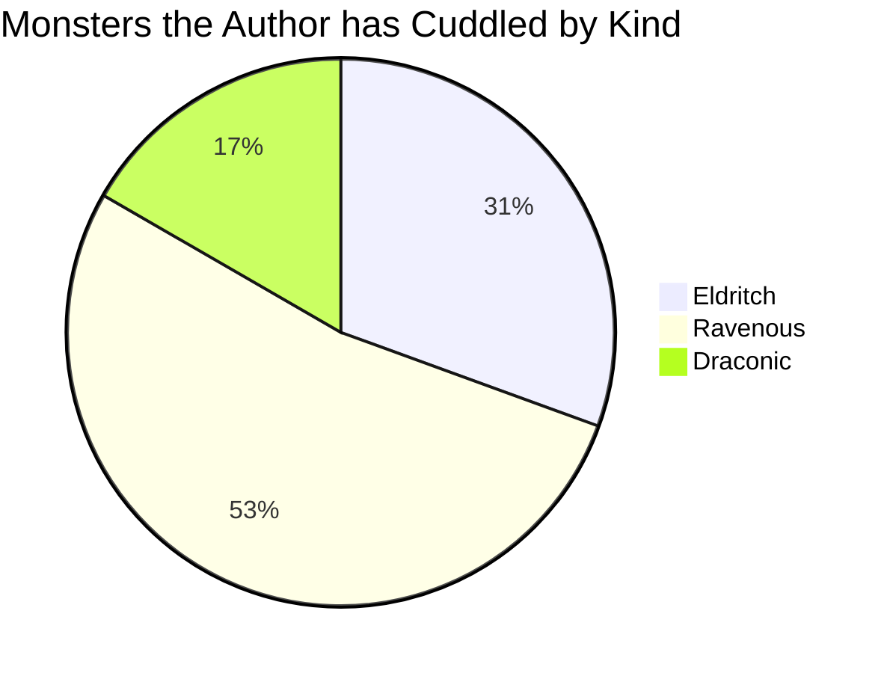

The `details` codeblock markup makes it possible for you to add an accessible and semantically
accurate form of collapsible content to a page.

When used, it inserts a [sref:`<details>`][01] element with a [`<summary>`][02] element containing
text visible even when the block is collapsed and a [sref:`<div>`][03] element containing all of the
rendered Markdown. Readers can toggle the visibility of the block, showing and collapsing the
content.

## Syntax



## Examples

``````memo-example-renderer { title="Minimal Example" }
This text is rendered in a `details` element with a `summary` element. The body
text is formatted as Markdown.

Because no summary is specified, it uses the default summary. Note that you can
link [directly to this element](#details)

<!--- Example Start -->
```details
This is some _Markdown_.

You can use any valid Markdown, including:

- unordered
- lists

1. ordered
1. lists

> blockquotes
```
``````

``````memo-example-renderer { title="Attribute Parameter Example" }
This example adds the `info` class to the details element and sets a specific
summary.

Normally, you could use the link fragment `#short-example` to link to this
block; however, because this example sets the ID to `dex-2`, you use
[that fragment](#dex-2) instead.

<!--- Example Start -->
```details { .info #dex-2 summary="Short Example" }
Another _Markdown_ example.
```
``````

`````````memo-example-renderer { title="YAML Options Parameter Example" }
This example ensures the block is loaded in its collapsed state instead of open
and sets the `linkable` option to `false`. That prevents Platen from adding an
ID to the summary.

Note that this example also uses more backticks (`` ` ``) for the codeblock.
That lets you include nested codeblocks inside the details. Here it's used to
add a [mermaid diagram](mermaid.md).

<!--- Example Start -->
``````details
---
summary: With Nested Codeblock
linkable: false
open: false
---

Check out this neat diagram:


``````
`````````

## Attributes

### `class` { #attribute-class }

Specify a string for the [sref:`class`][04] attribute of the details element. By default, it has no
class and the div element containing the content has the `markdown-inner` class.



### `id` { #attribute-id }

Specify an ID to use for the summary. If this value isn't specified, the summary's ID is set to the
lowercased and urlized form of the summary's input text. For example, the summary value
`Really Important Info` would become the ID `really-important-info`.

This value is ignored if `linkable` is set to `false`.



### `summary` { #attribute-summary }

Specify the text you want to use in the  [sref:`<summary>`][02] element. The default is `Details`.



## YAML Options

### `class` { #option-class }

Specify a string for the [sref:`class`][04] attribute of the details element. By default, it has no
class and the `div` element containing the content has the `markdown-inner` class.



### `id` { #option-id }

Specify an ID to use for the summary. If this value isn't specified, the summary's ID is set to the
lowercased and urlized form of the summary's input text. For example, the summary value
`Really Important Info` would become the ID `really-important-info`.

This value is ignored if `linkable` is set to `false`.



### `linkable` { #option-linkable }

Specify whether the summary should have the ID added to it, making it possible to link directly to
the block. The default value is `true`. Set this to `false` to skip adding the ID to the summary.



### `open` { #option-open }

Specify whether the rendered details should be open when the page loads. The default value is
`true`. Set this value to `false` to have the details collapsed when the page loads.



### `summary` { #option-summary }

Specify the text you want to use in the  [sref:`<summary>`][02] element. The default is `Details`.



## Definition

Specify the text you want to include in the body of the `details` element. You can include any valid
Markdown, including other codeblocks. To use nested codeblocks, you must have more backticks
(`` ` ``) in the fence for the details codeblock than any of the nested codeblocks.

<!-- Link References -->
[01]: mdn.html.element:details
[02]: mdn.html.element:summary
[03]: mdn.html.element:div
[04]: mdn.html.global_attribute:class
