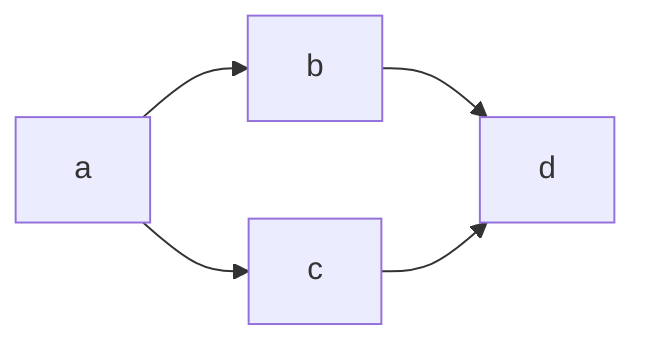
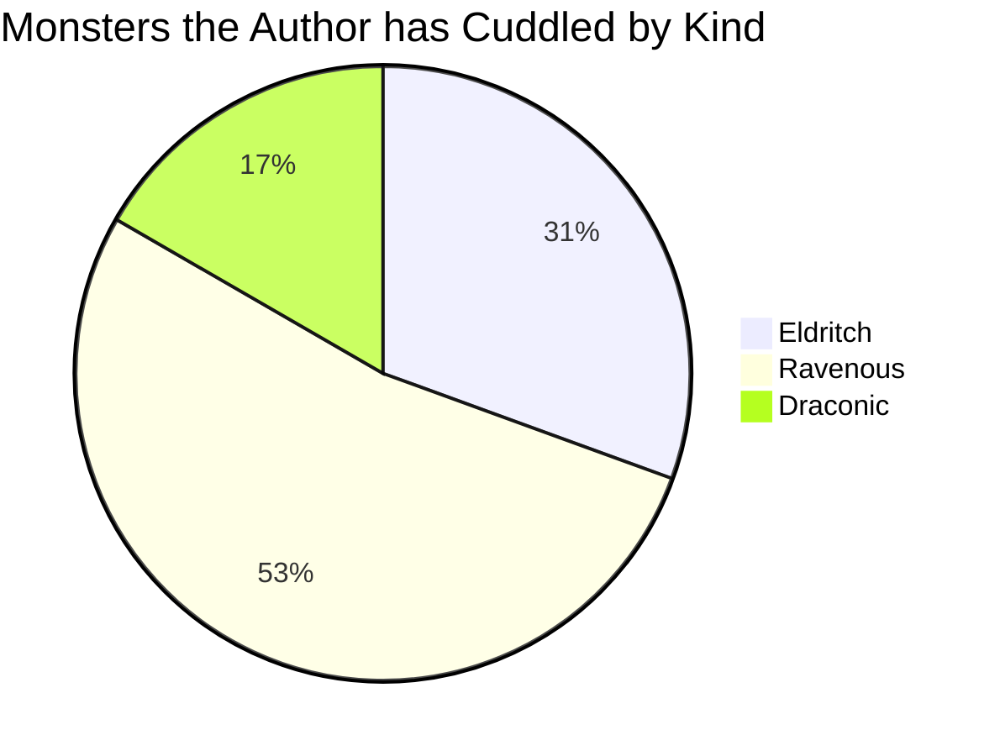
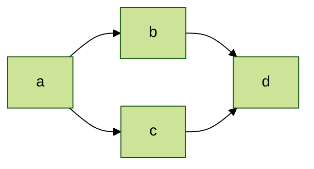

With the `mermaid` language ID, you can render flowcharts and other diagrams in your content
by writing [Mermaid markup][01] inside of a codeblock.

## Syntax



## Examples

``````memo-example-renderer { title="Flowchart" }

``````

``````memo-example-renderer { title="Pie Chart" }

``````

``````memo-example-renderer { title="With Initialize Directive" }

``````

``````memo-example-renderer { title="As Figure" }

``````

## Attributes

### `class` { #attribute-class }

Specify any additional classes to add to the Mermaid-containing element. By default, the Mermaid
code is placed in its [container](#attribute-container) element that has the `mermaid` class.

If [`as_figure`](#attribute-as_figure) is `true`, the classes are added to both the figure and the
container element.



### `id` { #attribute-id }

Specify a page-unique ID to use as the `id` attribute of the Mermaid-containing element. If
[`as_figure`](#attribute-as_figure) is `true`, the ID is added to the figure instead.



### `as_figure` { #attribute-as_figure }

Specify whether to render the mermaid diagram inside a [sref:`<figure>`][s01] element. When this
value is `true`, the mermaid diagram is added inside a figure and the `id` and `class` both apply to
that figure. The `class` is also inherited on the container for the diagram.



### `container` { #attribute-container }

Specify an alternate container element for the Mermaid-containing element. By default, the Mermaid
code is placed in a `pre` element. The value you specify for this attribute is used as the open and
closing tag name for the container element. For example, if you specify `div`, the Mermaid code is
placed in a `div` instead of `pre`.



## YAML Options

### `as_figure` { #option-as_figure }

Specify whether to render the mermaid diagram inside a [sref:`<figure>`][s01] element. When this
value is `true`, the mermaid diagram is added inside a figure and the `id` and `class` both apply to
that figure. The `class` is also inherited on the container for the diagram.



### `caption` { #option-caption }

Specify Markdown to use as the caption for the figure element. If this value is set, the Mermaid
diagram is rendered inside a figure element even if [`as_figure`](#option-as_figure) isn't set to
`true`.

The caption's Markdown is rendered as a block without wrapping [sref:`<p>`][s02] tags inside a
[sref:`<figcaption>`][s03] element. By default, it's added beneath the diagram.

You can use the [`caption_position`](#option-caption_position) option to render the caption above
the Mermaid diagram in the figure.



### `caption_position` { #option-caption_position }

Specify either `top` or `bottom` to render the figure's caption above or below the Mermaid diagram.
The default value is `bottom`. This option is ignored if [`caption`](#option-caption) isn't set or
is empty.



### `class` { #option-class }

Specify any additional classes to add to the Mermaid-containing element. By default, the Mermaid
code is placed in its [container](#attribute-container) element that has the `mermaid` class.

If [`as_figure`](#option-as_figure) is `true` or [`caption`](#option-caption) is set, the classes
are added to both the figure and the container element.



### `container`{ #option-container }



### `id`{ #option-id}

Specify a page-unique ID to use as the `id` attribute of the Mermaid-containing element. If
[`as_figure`](#option-as_figure) is `true` or [`caption`](#option-caption) is set, the ID is added
to the figure instead.



## Definition

There are two components to the definition syntax inside the codeblock: the Mermaid intialize
directive and the Mermaid syntax.

The only required component is the actual Mermaid diagram  syntax. This defines the
diagram that Mermaid renders. For more information about creating diagrams with Mermaid, see the
[Mermaid documentation][02].

### Initialize Directive

Immediately before the diagram syntax, you can specify an initialize directive for Mermaid. This
overrides the [sref:site's Mermaid configuration][s04] for this diagram only.

You can add the initialize directive on a single line:

```text
%%{ init:{ <settings> } }
```

Or multiline:

```text
%%{
  init: {
    <settings>
  }
}%%
```

For more information on the initialize directive, see ["Directives" in Mermaid's documentation][03].

### Mermaid Markup

The diagram syntax uses the standard Mermaid syntax for defining diagrams. For more information, see
["Diagram Syntax" in the Mermaid documentation][04].

<!-- Link References -->
[01]: https://mermaid-js.github.io/mermaid/#/
[02]: https://mermaid.js.org/intro/n00b-syntaxReference.html
[03]: https://mermaid.js.org/config/directives.html
[04]: https://mermaid.js.org/intro/n00b-syntaxReference.html#diagram-syntax
[s01]: mdn.html.element:figure
[s02]: mdn.html.element:p
[s03]: mdn.html.element:figcaption
[s04]: Platen.Site.Features.Mermaid
