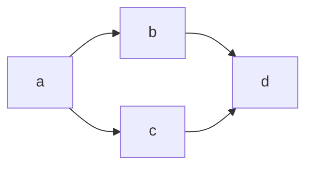
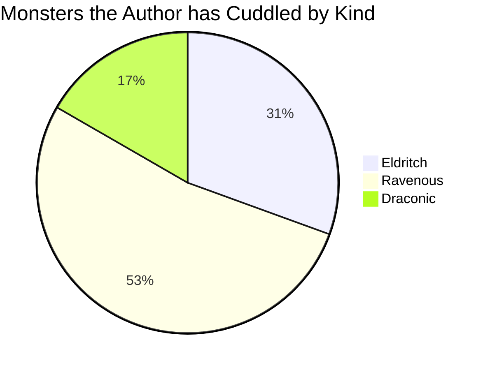
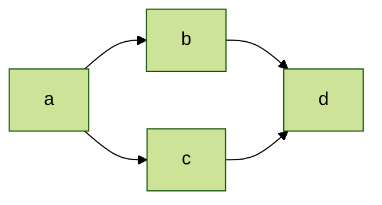

With the `mermaid` language ID, you can render flowcharts and other diagrams in your content
by writing [Mermaid markup][01] inside of a codeblock.

By default, when your Mermaid markup is rendered with a codefence, it's rendered in display mode.
This centers the rendered markup and adds a top and bottom margin to the block.

## Syntax



## Examples

``````memo-example-renderer { title="Flowchart" }

``````

``````memo-example-renderer { title="Pie Chart" }

``````

``````memo-example-renderer { title="With Initialize Directive" }

``````

``````memo-example-renderer { title="As Figure" }
```mermaid
Caption: An example flowchart
<!-- Mermaid -->
flowchart LR
  a --> b & c--> d
```
``````

## Attributes

### `class`

Specify any additional classes to add to the Mermaid-containing element. By default, the
Mermaid code is placed in a `pre` element that has the `mermaid` class.

When you use the [advanced syntax](#advanced) to render the Mermaid as a figure, this value is also
used for the `class` attribute of the `figure` element.



### `element`

Specify an alternate container element for the Mermaid-containing element. By default, the Mermaid
code is placed in a `pre` element. The value you specify for this attribute is used as the open and
closing tag name for the containing element. If you specify `div`, the Mermai code is placed in a
`div` instead of `pre`.



### `id`

Specify a page-unique ID to use as the `id` attribute of the Mermaid-containing element or, if using
the [advanced syntax](#advanced), the `figure` element.



## Definition

There are three components to the definition syntax inside the codeblock: the figure options yaml,
the Mermaid intialize directive, and the Mermaid syntax.

The only required component is the actual Mermaid diagram declaration and syntax. This defines the
diagram that Mermaid renders. For more information about creating diagrams with Mermaid, see the
[Mermaid documentation][a].

### Initialize Directive

Immediately before the diagram syntax, you can specify an initialize directive for Mermaid. This the
site's Mermaid configuration for this diagram only.

You can add the initialize directive on a single line:

```text
%%{ init:{ <settings> } }
```

Or multiline:

```text
%%{
  init: {
    <settings>
  }
}%%
```

For more information on the initialize directive, see [foo]. For more information about the
available settings, see [bar].

### Figure Options

You can also pass a map of options that render the mermaid diagram inside a `figure` element. You
can pass these options by specifying them as YAML, JSON, TOML, or CSV, followed by the separator, `<!-- Mermaid -->`.

If the separator is specified, the diagram is rendered as a figure, even if you don't specify any options.

The rest of this section details the available options. For an example that uses every option, see
[Comprehensive Figure Options](#comprehensive-figure-options) at the end of this section.

#### `Caption`

Specify a caption for the figure. If this value is a string, the value is rendered as markdown and
added to the bottom of the figure after the Mermaid diagram in a `figcaption` element.

If this value is a map, it must define the `Text` property and may define the `AtTop` property. The
`Text` value is rendered as markdown and placed inside the `figcaption` element. If `AtTop` is set
to `true`, the caption is added at the top of the figure before the Mermaid diagram.

#### Comprehensive Figure Options

```memo-example-data
Caption:
  Text: |-
    This Markdown will be rendered in a
    `figcaption` at the top of the figure.
  AtTop: true
```

[01]: https://mermaid-js.github.io/mermaid/#/
